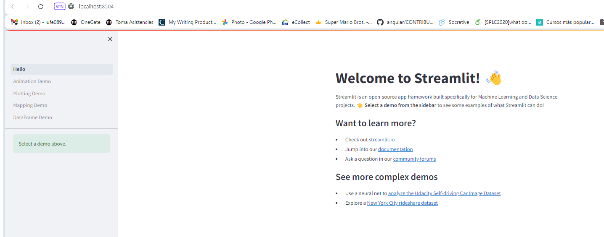
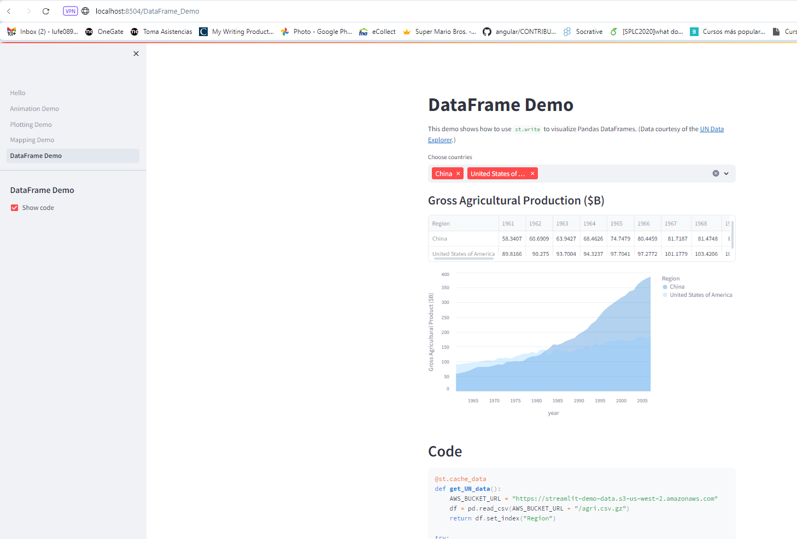

# Configurando tu entorno de desarrollo local

Antes de empezar a desarrollar nuestras aplicaciones, vamos a necesitar primero configurar el entorno de desarrollo.

## **Abrir Pycharm**
- Abre Pycharm y crea un nuevo proyecto llamado (sus iniciales)

## Instalar streamlit y otras librerías
Abra el terminal del entorno de de desarrollo y escriba el siguiente comando para instalar `streamlit`:
```bash
pip install -r requirements.txt
```
Se debe iniciar la descarga de las dependencias


## **Ejecutar la aplicación demo de Streamlit**
Para ejecutar la aplicación demo (Figura 1) ingrese:
```bash
streamlit hello
```
Note que abre una nueva ventana en el navegador


Navegue por las diferentes opciones. Por ejemplo en el `Dataframe Demo` seleccione la opción
para mostrar y ocultar código fuente



### Agregar elementos
Crea un archivo con el nombre `streamlit_app.py`

### Ingresando tus primeras lineas de código

En el archivo recientemente creado, ingresa las siguientes lineas de código:

```
import streamlit as st

st.write('Hello world!')
```

Guarda el archivo.

## Enciende tu terminal de linea de comandos

En la terminal, ingresar lo siguiente:

```
streamlit run src/streamlit_app.py
```

Una ventana de tu explorador debería abrirse mostrando la Streamlit app recién creada.

**Felicitaciones!** Acabas de crear tu primera Streamlit app!


## Instrucciones generales
Esta tutorial fue adaptad0 del tutorial de 30 dias con streamlit disponible en 
https://30days.streamlit.app

La carpeta de actividades tiene diferentes archivos markdown que lo llevarán a explorar diferentes componentes de streamlit.
Para cada componente cree un archivo separado. 
La ejecución del código creado debe hacerse siguiendo este conjunto de instrucciones desde el
terminal: 
```
streamlit run nombreArchivo.py
```

### Orden para ejecutar las instrucciones
Navegue por cada archivo de la carpeta actividades en el mismo orden en el que están nombrados.
Durante el proceso aprenderá a usar:
botones, escribir texto, radio buttons, checkbox, formularios, separación de layouts, formularios, barras de progreso, charts de líneas y sesiones para la interfaz gráfica

