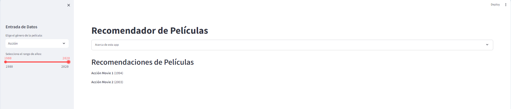

# Integración controles y lógica de aplicación
Streamlit ofrece varios widgets que permiten a los usuarios interactuar con la aplicación. 
Cada widget puede ser vinculado directamente a una variable en Python, y el estado de este widget puede ser usado para influir en otras partes de la aplicación.

* **Asignación de estado de widget a una variable**: Cuando un usuario interactúa con un widget, el estado del widget (como el valor de un slider o si un botón ha sido presionado) se almacena en una variable.En Streamlit, esto se hace de forma directa, por ejemplo, `valor = st.slider('Elige un número', 0, 100)`. Aquí, `valor` almacena el número que el usuario elige en el `slider`.
* **Uso de la variable en el código**: Una vez que tienes esta variable, puedes usarla en cualquier parte de tu código Python para controlar la lógica de la aplicación. Por ejemplo, puedes usar valor para filtrar datos, calcular algo o decidir qué mostrar en pantalla.

## Code
```python
import streamlit as st

# Configuración de la página en modo ancho
st.set_page_config(layout="wide")

# Título de la aplicación
st.title('Recomendador de Películas')

# Simulación de algunas películas
peliculas = {
    'Acción': [('Acción Movie 1', 1994), ('Acción Movie 2', 2003)],
    'Comedia': [('Comedia Movie 1', 1992), ('Comedia Movie 2', 2011)],
    'Drama': [('Drama Movie 1', 1988), ('Drama Movie 2', 2000)]
}


# Expander para información sobre la app
with st.expander('Acerca de esta app'):
    st.write("""
        Esta aplicación recomienda películas basadas en el género y el rango de años seleccionados por el usuario.
        Utiliza datos simulados y es solo un ejemplo de cómo puedes estructurar tu aplicación Streamlit.
    """)
    st.image('https://streamlit.io/images/brand/streamlit-logo-secondary-colormark-darktext.png', width=250)

# Entrada de datos en la barra lateral
st.sidebar.header('Entrada de Datos')
genero = st.sidebar.selectbox('Elige el género de la película:', ['', 'Acción', 'Comedia', 'Drama'])
año_inicio, año_fin = st.sidebar.slider('Selecciona el rango de años:', 1980, 2020, (1990, 2010))

# Lógica para recomendar películas basada en la entrada
def obtener_recomendaciones(genero, año_inicio, año_fin):

    recomendaciones = []
    for nombre, año in peliculas[genero]:
        # Revisar si el año de la película está dentro del rango especificado
        if año >= año_inicio and año <= año_fin:
            recomendaciones.append((nombre, año))
    return recomendaciones

# Output de recomendaciones
st.header('Recomendaciones de Películas')
if genero and año_inicio and año_fin:
    recomendaciones = obtener_recomendaciones(genero, año_inicio, año_fin)
    if recomendaciones:
        for pelicula, año in recomendaciones:
            st.write(f"**{pelicula}** ({año})")
    else:
        st.write("No se encontraron películas que coincidan con los criterios.")
else:
    st.write("Por favor, selecciona un género y ajusta el rango de años para obtener recomendaciones.")`

```
## Como se ve la app 


# Extender la APP
> Has los ajustes que el código requiera para lograr los siguientes cambios. Trata de usar funciones para tener código limpio en la solución y recuerda informar a los usuarios de los progresos de la app

1. Añade una opción adicional de filtrado para hacer clasificación por edad.  Usa el control de streamlit que quieras
2. Añade una opción adicional de filtrado para hacer clasificación por nombre de película
3. Agrega una funcionalidad para agregar nuevas películas a la lista de películas
4. Agrega una funcionalidad para ver todas las películas
5. Agrega una funcionalidad para eliminar películas
6. Agrega otra funcionalidad, la que quieras a la aplicación
